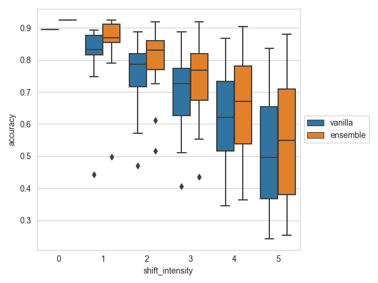
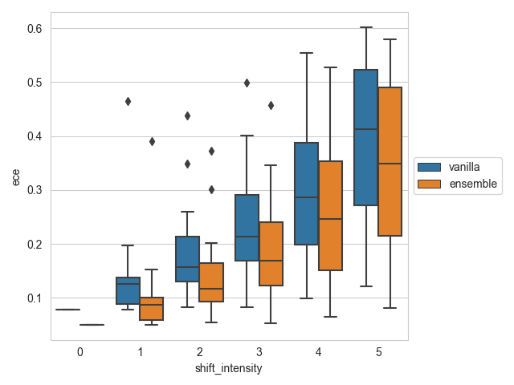

# Can You Trust Your Model’s Uncertainty? Evaluating Predictive Uncertainty Under Dataset Shift
Reproducing [Can You Trust Your Model’s Uncertainty? Evaluating
Predictive Uncertainty Under Dataset Shift](https://arxiv.org/abs/1906.02530)


This repository contains:
- CIFAR-10 ResNet-20 training script. The test accuracy based on this script is around 90%
- Initial evaluation of uncertainty under dataset shift for:
  - a vanilla model
  - an ensemble

The training code uses TensorFlow 2.9.

## Setting up the environment
This repository uses `poetry` for package management.
For Linux or Apples without an M1, run
```commandline
poetry install --with tensorflow
```
If you have an M1 MacBook, you can run
```commandline
poetry install --with tensorflow-m1
```
to install `tensorflow-macos` and `tensorflow-metal`. 


## Training
To train the ResNet on CIFAR-10, run:
```commandline
poetry run python dsu/train/main.py --cfg-file ca/train/config/0.json
```
The default configuration leads to a test accuracy of about 90%.
The training can use Weights and Biases (`wandb`) for tracking the training runs.
Training CIFAR-10 for 200 epochs on an M1 MacBook takes about 1 hour.


## Evaluation
To save boxplots with the test accuracy and expected calibration error per corruption, you need
to have:
- A directory with saved models
- Downloaded the [CIFAR-10-C dataset](https://zenodo.org/record/2535967#.Y_IcgrTP3do):
  ```commandline
    curl https://zenodo.org/record/2535967/files/CIFAR-10-C.tar > CIFAR-10-C.tar
  ```
Then, run a command like this to evaluate a vanilla model and an ensemble with five members:
```commandline
poetry run python dsu/eval.py \
--model-path models/comfy-bird-187/176-0.9117 \
--ensemble-path models/comfy-bird-187/176-0.9117 \
--ensemble-path models/dainty-capybara-188/193-0.9081 \
--ensemble-path models/olive-night-189/147-0.9093 \
--ensemble-path models/sweet-valley-190/104-0.9097 \
--ensemble-path models/fearless-firebrand-186/101-0.9040 \
--output-path ./results \
--cifar-c-dir ./CIFAR-10-C
```


## Results



Accuracy is somewhat higher than reported in the paper, but ECE is also higher.